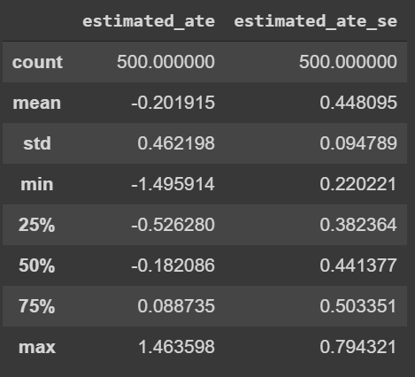
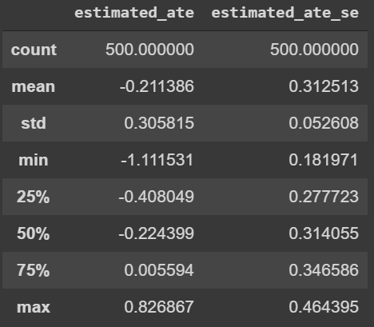

<h1 align="center"> Problem Set #3 </h1>

Creator: <font color="blue">Junjie Lei</font>

CreationDate: <font color="blue"> Feb_10</font>

Title: <font color="blue">Problem Sets #3 experiments and regressions </font>

Notes: [$Colab$](https://colab.research.google.com/drive/1xmZXb29jz1nrVD87hR1gbC4W5dVBUNZa)

---

<h2 align="center">In-class notebook exercises</h2>

<h3 align="center"> Replicate and simulate a real study </h3>

1.1.1

```python
print(r_col3.summary())
print(r_col4.summary())
```


1.1.2

- $\textit{Column 4}$  has more control variables

- to calculate the $\textit{R Square}$ 

  ```python
  print(r_col3.rsquared) ## --> 0.0671339542940943
  print(r_col4.rsquared) ## --> 0.10819457890249662
  ```

  $\textit{Column 4}$ has a higher R-squared, because it contains more control variables hence the model has more explanatory power; 

  

-  to calculate the $\textit{Std.ev}$

  ```python
  print(r_col3.bse.rem_any) ## --> 0.009153114318622113
  print(r_col4.bse.rem_any) ## --> 0.008949743622819572
  ```

  $\textit{Column 4}$ has a smaller a standard error on the estimated $\textit{ATE}$ ; 


1.1.3


- for the estimation of the effect of `rem _any` in the experiments; 

  the estimated coefficients and the standard error are listed as follow

  ```python
  print(r_col3.params.rem_any)  ## --> 0.03185505049068642
  print(r_col4.params.rem_any)  ## --> 0.03186131518614749
  print(r_sim_biv.params.d)     ## --> 0.031709816056386286
  print(r_sim_control.params.d) ## --> 0.03240621068111807
  ```

  - the estimated coefficients and the standard error from the simulation are pretty close to real data;


1.1.4

- set the `beta_hs = 0.35` for the simulation
- set `B = 1000` 

similar to the `compare_lpm_prop_test` function, we define a new function

```python
def new_simulation_finction(
  N = 10000,
  beta_hs = 0.35,
  ATE = 0.032
):
  grad_high_school = np.random.binomial(n=1, p=0.5, size=N)
  D = np.random.binomial(n=1, p=0.61, size=N)
  baseline_probability = 0.25 + beta_hs * grad_high_school
  Y0 = np.random.binomial(n=1, p=baseline_probability)
  Y1 = np.random.binomial(n=1, p=baseline_probability + ATE * D)
  dff = pd.DataFrame({
    'grad_high_school': grad_high_school,
    'd': D,
    'y0': Y0,
    'y1': Y1
  })
  dff['y'] = dff.eval("y1 * d + y0 * (1 - d)")
  regr = sfa.ols("y ~ d", dff).fit()
  a = regr.params['d']
  return a
```

and we loop it;

```python
B = 1000
res = pd.DataFrame([new_simulation_function() for i in np.arange(0, B)])
```

and we see the results; 


1.1.5

for this question, we replicate what we did from the previous simulation; 

and we plot the `params['d']` to show the estimated treatment effects;

 


1.1.6

from the model1 the $\textit{Std.ev} \rightarrow 0.009991$ 

from the model2 the $\textit{Std.ev} \rightarrow 0.009918$


1.1.7 

refer to the `Confidence Interval machine` 

```markdown
Left board of confidence lever for model 1 =  `0.03159373629542879`
Right board of confidence lever for model 1 =  `0.03284826370457121`
Left board of confidence lever for model 2 = `0.03114525827711666`
Right board of confidence lever for model 2 =  `0.032286741722883344`
```

and we count when the confidence intervals include the `true ATE` in each model

```python
k = 0
for i in np.arange(0, B):
  if ch[0][i] >= lboard1 and ch[0][i] <= rboard1:
    k = k+1
  else:
    k = k + 0
```

the output for `k` is $58$

---


<h3 align="center">1.2 Shoe technology experiment</h3>

1.2.1 

- set the baseline `inter-person variability ` $\rightarrow$ $5$ 

- use the `std()` function to find the standard deviation of the estimated $\textit{ATE}$;

$\textit{for the block distrivution} \rightarrow$ $0.134456$

$\textit{for the non-block distrivution} \rightarrow$  $0.236282$


1.2.2

- If we increase the `inter-person variabilty ` $\rightarrow$ 10, and rep

$\textit{for the block distrivution} \rightarrow$ $0.445792$

$\textit{for the non-block distrivution} \rightarrow$  $0.14316$

> if we increase the `inter-person variability` , then  the $\textit{Std.ev}$ of estimated ATE will also increases; 


1.2.3

- in this exercise, we simulate different levels of `inter-person variability` as follows


- and then we plot the values of  $\textit{Std.ev}$ under different levels of inter-person variability


1.2.4

`inter-person variability` indicates different person's changeability in choices.

if the inter-person variability = 0, then it indicates the homogeneity of person

however, if it = 20, then it means the heterogeneity between individuals


1.2.5  

- the red bins indicates the regression analysis under the `block design`
- the blue bins indicates the regression analysis under the `no block design `

         

- above is the standard errors under different `inter person variability`
  - 1st one is the `block design` with inter person variability of `5`
  - 2nd plot is `no-block design` with inter person variability of `20`


above is the standard errors under different `inter person variability`

- 1st one is the `no-block design` with inter person variability of `5`
- 2nd plot is `block design` with inter person variability of `20`


1.2.6 ***Bonus Question***

change score approach; use the lagged historical wear


1.2.7

if we cut the sample tp `N = 20` and use the inter person variability to be 20 

with `no-block design` 



and without `block design`




---

form $1.2.7 \rightarrow$ with `block design`, the standard error of the edtiamted ate is lower. But the trade off is we are in a much smaller sample size compared with the `covariate approach`


<h3 align="center">2 Regression</h3>

2.1

- $\textit{ATE}$  in this paper indicates the avergae treatment effect of how the `reminders`(treatment) increas savings to different groups of individuals

- $\textit{Coef}$ under the dummy variables `grad_high_school` provides a measure of the difference between group indetified by the variables `grad_high_school` and the group serves as a refernce. If the coefficient is positive, then it means for the person who complete 


2.2 

```python
B=1000
pvalues1 = []

for i in progressbar(np.arange(0, B)):
  sample = newfunction2(N = 13560, beta_hs = .35, ATE = 0.018)
  model1 = sfa.ols(formula='y ~ d', data=sample).fit()
  pvalues1.append(model1.pvalues.d)

pvalues1 = pd.Series(pvalues1)
stpower = (pvalues1 < .05).mean()
print("statistical power Model 1= ", stpower)
```

----

output: statistical power Model =  $0.523$

with the same code if we add the `control variable -- grad_high_school` in, then we can observe the new statistical power increases to $0.588$


2.3

if we change the parameter `Beta_hs`to $0.1$ then we can get 

```python
#Model 2
pvalues2= []

for i in progressbar(np.arange(0, B)):
  sample = newfunction2(N = 13560, beta_hs = .1, ATE = .018)
  model2 = sfa.ols(formula='y ~ d + grad_high_school', data=sample).fit()
  pvalues2.append(model2.pvalues.d)

pvalues2 = pd.Series(pvalues2)
stpower2 = (pvalues2 < .05).mean()
print(" new statistical power Model 2= ", stpower2)
```

---

output 

new statistical power Model 2=  $0.619$


2.4

- from the previosu simulation, it is easy to observe that when we lower the `beta_hs`, we got an much higher experiment's statistical power 

2.5 

- form previous questions together, if we have a lower coefficients on the control varaibles, then we expected to find a higher experiment's main variables (here, it is the $\textit{d}$  treatment effect) 

- so when in the data collecting process, we expect the control variables to be less correlated with the independent variable (which represents the treament)


 <h3 align = 'center'> 3 Shoe tech experiment redux </h3>

3.1

```python
B=1000
list_noblock = []

for i in progressbar(np.arange(0, B)):
  sample = gen_shoe_data(N=100, block=False, person_variability=20)
  noblock2 = sfa.ols(formula='y ~ d', data=sample).fit()
  list_noblock.append(noblock2.pvalues.d)

list_noblock = pd.Series(list_noblock)
stpower_noblock = (list_noblock < .05).mean()
print("the statistical power of the non-blocking design = ", stpower_noblock)
```

---

output: 

the statistical power of the non-blocking design =  $0.048$

with the same `block & no-block design`, if we modify the formula to `formula = 'y ~ d + r_yo'` then we can rewrite the code to be:

```python
B=1000
list_block = []

for i in progressbar(np.arange(0, B)):
  sample = gen_shoe_data(N=100, block=False, person_variability=20)
  block2 = sfa.ols(formula='y ~ d + r_y0', data=sample).fit()
  list_block.append(block2.pvalues.d)

list_block = pd.Series(list_block)
stpower_block = (list_block < .05).mean()
print("the statistical power of the blocking design = ", stpower_block)
```

---

output: 

the statistical power of the blocking design =  $0.271$


3.2

$\textit{Block}$ can increase power becasue block group together similar units into the a block and split each block into treatment and control group which balances the characteristics across control and treatment groups and ultimately minimize the extraneous variation in our estimated ATE. It is a completely randomized design. 


3.3

- add covariates and control varaibles can soak up the variations in the outcome and make the estimations more precise because the control variables implemented potentially can shrink the residuals


3.4  

- "Change scores" analysis the before and after differences; we use the differnces in estiamtion of $Y^{0} \& Y^{1}$ to  get precise estiamte the treatment effect;


3.5

- for blocking, each person effectively serves as their own control group. It is a compelely randomized design. But this technique is effective only when there is a high heterogenity between the people. like what we implemented before the `inter person varaibility ` parameter. 
- for the estimation of changing scores techniques, each observation sereves as their own control. we can add pre-treatment covariates that  predict the putcome, but with this approach, we can not rollback. 

- for the use of convariates in the regression,  it is a very robust techiquqe, gernerlization of averaging and very convient for estimating the treatment effects in experiments. But choosing the right covariates, unbiased control variables can be challenging. 


 <h3 align = 'center'> Bonus </h3>

```python
B=5000

list_noblock = []

for i in progressbar(np.arange(0, B)):
  sample = gen_shoe_data(N=100, block=False, person_variability=20)
  noblock3 = sfa.ols(formula='y ~ d + r_y0', data=sample).fit()
  list_noblock.append(noblock3.pvalues.d)

list_noblock = pd.Series(list_noblock)
stpower_noblock = (list_noblock < .05).mean()
print("the statistical power of the non-blocking design = ", stpower_noblock)
```

---

output:

the statistical power of the non-blocking design + regression=  $0.2772$

```python
B = 5000
list_block = []

for i in progressbar(np.arange(0, B)):
  sample = gen_shoe_data(N=100, block=True, person_variability=20)
  block3 = sfa.ols(formula='y ~ d + r_y0 ', data=sample).fit()
  list_block.append(block3.pvalues.d)

list_block = pd.Series(list_block)
stpower_block = (list_block < .05).mean()
print("the statistical power of the blocking design = ", stpower_block)
```

---

output:

the statistical power of the blocking design  =  $0.295$


but if we just run it with block design and without person's wear-rate 

```python
B = 5000
list_block = []

for i in progressbar(np.arange(0, B)):
  sample = gen_shoe_data(N=100, block=True, person_variability=20)
  block3 = sfa.ols(formula='y ~ d ', data=sample).fit()
  list_block.append(block3.pvalues.d)

list_block = pd.Series(list_block)
stpower_block = (list_block < .05).mean()
print("the statistical power of the blocking design = ", stpower_block)
```

the statistical power will be $0.2866$


---


