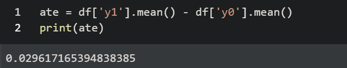

<h1 align="center">Problem Set 4</h1>
Creator: <font color="blue">Junjie Lei</font>

CreationDate: <font color="blue"> Feb_23/2020</font>

Title: <font color="blue">Causal Inference Assignment04  -- Practical Sources of bias</font>

Note: My [Colab](https://colab.research.google.com/gist/JunjieLeiCoe/8cce94c4fec9381b077fcc5c0bec055a/lecture-04-practical_sources_of_bias.ipynb?authuser=1#scrollTo=H8CGE_nl48Bm)


<h2 align="center">1. In-class foundation</h2>

1. 

   - the $ATE = 0.03$

   - selection bias = $E[Y^0 | d = 1 ] - E[Y^0 | d = 0 ] = -0.039 $  

   - Differential effect bias = $E[Y^1 - Y^0 | D = 1] - E[Y^1 - Y^0 | D = 0] =-0.001198 $  

   - $$ NATE = ATE + \textit{Selection Bias} = + \textit{Differential Effect Bias} = -0.01092719  $$   

   - Calculate $NATE$ using the `nate` function = $-0.010903325$

   - We have 2 kinds of biases $\textit{Selection Bias}$  \&  $\textit{Differential Bias}$ 

     however, the  $\textit{Differential Bias}$  seems very trivial compared to the NATE, hence we can say that $\textit{Selection Bias}$ is the <u>main bias here.</u>
     
     ```
     df['delta'] = df['y1'] - df['y0']
     df.head()
     ```
     
     
     
     ```python
     #selection bias:
     sb = df.query("d==1")['y0'].mean() - df.query("d==0")['y0'].mean()
     print(sb)
     
     #differential effect bias:
     #deb = df.query("d==1")['y1'].mean()-df.query("d==1")['y0'].mean() - (df.query("d==0")['y1'].mean()-df.query("d==0")['y0'].mean())
     deb = df.query("d==1")['delta'].mean()-df.query("d==0")['delta'].mean()
     print(deb)
     
     #NATE by decomposition:
     print(0.03+sb+deb)
     
     #NATE using function:
     print(estimate_nate(df))
     ```
     
     

2. 

   ​	

   Independence assumption holds true when the following conditions are met:

   (1) E[Y0|D=1] = E[Y0|D=0]; 

   (2) E[Y1|D=1] = E[Y1|D=0]

   

   Condition (1) is not met: E[Y0|D=1] - E[Y0|D=0] = -0.03973

   Condition (2) is not met: E[Y1|D=1] - E[Y1|D=0] = = - 0.040927

   

   => Independence assumption does not hold.


3. 

   

ATE calculated from the data = E[Y1] - E[Y0] = 0.029617 which is approximate to the ATE set in generate experiment function.


4. 


ATE = 0.030351581467128186

Selection bias = E[Y0|D=1] - E[Y0|D=0] = -0.00041967518384157905

Differential effect bias = E[Y1-Y0|D=1] - E[Y1-Y0|D=0] =  0.000543332160684533

NATE = ATE + selection bias + differential effect bias = 0.030123656976842952

NATE without perfect stratification: -0.010903325481920106

We can have unbiased ATE this time since NATE is very close to ATE. This work because we somehow eliminate the variation during the week by stratify on the basis of date. By doing so, the variation will get smaller.

5. 


<h2 align="center">Homework Extension</h2>

1. 

we got 

from the dataset. 


Doing a perfect stratification analysis by the hour of the day can't give an unbiased estimate (the result is -0.01099 while the ATE set in DGP is 0.03). Hour of the day is not a pattern like day of the week as showed in graph above - there's hardly any trend of conversion rate based on hour. The experiment last for 14 days and data is generated based on days. While hour is only randomly added to units. If our data is generated based on hours during day, then the stratification may work.


2. 

true ATE 


estimate the ate using a regression --> 0.0680


 estimate the ATE using a perfect stratification on `day_of_week`


***from all above, both give unbiased estimate since both results are closed to the true ATE.***


<h2 align="center">Bonus </h2>

Regression with day_of_week as control variable: this estimator gives unbiased ATE estimate since it takes into account day of week as a factor that could influence the estimate.

Stratification on day_of_week help reduces the variation in ATE between days during the week. These 2 estimators work since the true ATE is set to vary by day. If ATE varies by week or hour during the day, these might not work.


<h2 align="center">2. One-sided noncompliance in a web experiment </h2>


1. 

assignment is the $Z$ which is the `coin flips`

`saw the page is `the treatment $D$


2. 

- the `saw_treatment_page == coin_flips` indicates the individuals who complies to the assignments meaning that $D_i(Z_i) = Z_i $

- `viewed_page == 1`  indicates those who see the treatment page. it contains either the  treatment compliers $(D(Z=1)=1$ and the control defiers $(D(Z=0)=0)$. always taker group

- the main differences for these 2 is that`saw_treatment_page == coin_flip` has the $D(Z=0)=0$ but the `viewed_page == 1` only contains the $D(Z=0)=1$ group. 


3. 


the as-treated estimates is 0.281

the`as-treated` estimate ignores that people who were given the assignments can actually defy or act in the totally opposite way. In this case, we can no longer say that $E(Y^0) \& E(Y^1)$ in independent because now the besides treatment and assignments there are other factors influences individuals' decisions; i.e charitability.


4. 

```python
r_itt_1 = sfa.ols("y ~ coin_flip + charitability", df).fit(co
v_type='HC1')
r_itt_2 = sfa.ols("y ~ coin_flip + viewed_page", df).fit(cov_
type='HC1')
```

$Coef_{view page}$  = 0.221

$Coef_{coin flip}$  = 0.1626


using the ITT regression but including different covariates did not help us improve and identify the ATE estimates. 


5. 

```python
complier_ratio = df.query('viewed_page == coin_flip').unit.count()/df.unit.count()
IIT = r_itt.params['coin_flip']
CACE = IIT / complier_ratio
```


ITT = $0.0997$

CACE is $0.199575168$

- ITT tend to underestimate the ATE, because it assumes E(Y) is the same as Z. 
- CACE can be used to restore/improve ATE by using the P(D = 1)


<h2 align="center">Heterogeneous treatment effects</h2>


1. 

```python
df.y1.mean() - df.y0.mean()
```

output --> 0.148


2. 


the ATE and CACE in this case were hard to identify and pretty much deviate from the true treatment effect. 

they are pretty much far away from the ATE -> 0.15 


3. 

```python
cace_1 = sfa.ols("y ~ coin_flip + charitability", df4.query("viewed_page == 1")).fit(cov_type='HC1')
print(r_cace_1.summary(yname="Conversion"))
```

In the previous problem, the `CACE` can help/improve to find the ATE estimate;

- but now it is hard for us to identify, because in the previous problem we can stratify, but in this case, after we adding the covariate of charitability, we can no longer control for each individual decision.


4. 

if we still have the `coin_flip` and `saw_treatment_page` it is possible for us to restore/guess the missing data with some deviation, but now we are expecting a lower estimation. The accuracy of estimation will be affected because we still need to identify the individuals who `treatment (saw_page)== assingment(coin_flip)`; and the `view_page` is a binomial distribution with probability of `charability`, hence a lower estimation of ATE is expected in this scenario. 


---

JUNJIE